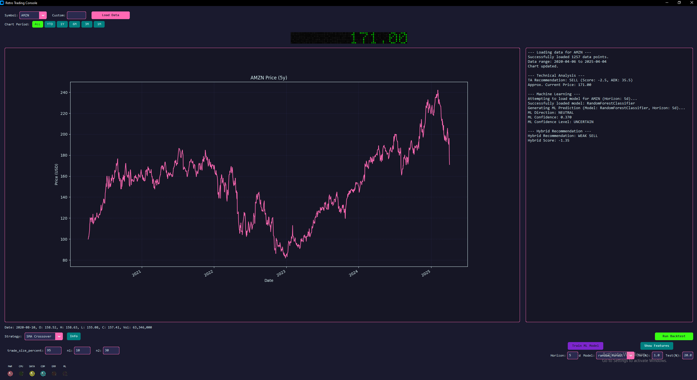

# Stocker - Retro AI Trading Console

A retro-themed stock trading application with backtesting, machine learning predictions, AI-powered sentiment analysis, and fully automated trading -- all wrapped in a Miami Vice / Fallout-inspired interface.



## Features

**Market Data & Charting**
- Historical OHLCV data via yfinance or Alpha Vantage
- Interactive charts with adjustable time periods (1M to ALL)
- Custom and preset stock symbol support

**Strategy Backtesting**
- 10 built-in strategies: SMA Crossover, RSI, MACD, Bollinger Bands, Volatility Breakout, Ichimoku Cloud, Donchian Channel, Day of Week, and two moon phase strategies
- Configurable parameters per strategy (period lengths, thresholds, trade size)
- Trade-by-trade results with performance metrics

**Machine Learning**
- 3-class directional prediction (UP / NEUTRAL / DOWN) with confidence scoring
- 40+ engineered features from price, volume, technical indicators, and calendar data
- Random Forest, Gradient Boosting, and Logistic Regression models
- Hybrid recommendation engine blending ML signals with technical analysis
- Feature importance visualization

**AI Sentiment Analysis**
- Claude-powered market sentiment analysis
- Processes price data, technical indicators, and ML predictions
- Generates HTML reports with retro-themed styling
- Outputs: POSITIVE / NEUTRAL / NEGATIVE with confidence and key factors

**AI Auto-Trading** *(New)*
- Fully automated trading via Alpaca broker API (paper and live)
- Claude AI reviews ML signals and makes final go/no-go decisions each hour
- Configurable budget, direction (long/short/both), and risk parameters
- Discord webhook notifications for all trade actions
- Kill switch with liquidation option always accessible in the header
- Dedicated LED indicators (AUTO, AI) for real-time status

**Retro UI**
- Worn LED indicators with flicker effects (PWR, CPU, DATA, COM, ERR, ML, AUTO, AI)
- Dot matrix recommendation display with color-coded signals
- Neon color scheme: pink buttons, cyan text, dark blue backgrounds
- Monospace console log with color-tagged messages

## Quick Start

### Prerequisites

- Python 3.10+
- TA-Lib C library (see [TA-Lib Installation](#ta-lib-installation))

### Install & Run

```bash
git clone <repo-url>
cd stocker
pip install -r requirements.txt
python main.py
```

### Environment Variables

Create a `.env` file in the project root (loaded automatically via `python-dotenv`):

```env
# Required for AI Sentiment Analysis and Auto-Trading
ANTHROPIC_API_KEY=sk-ant-...

# Required for Auto-Trading
ALPACA_API_KEY=PK...
ALPACA_API_SECRET=...

# Optional - Alpha Vantage data source (alternative to yfinance)
ALPHA_VANTAGE_API_KEY=...

# Optional - Discord trade notifications
DISCORD_WEBHOOK_URL=https://discord.com/api/webhooks/...
```

All keys can also be entered directly in the app's UI.

### TA-Lib Installation

TA-Lib requires the C library installed before the Python wrapper:

- **Windows**: Download pre-compiled wheels from [Gohlke's page](https://www.lfd.uci.edu/~gohlke/pythonlibs/#ta-lib) or use `conda install -c conda-forge ta-lib`
- **macOS**: `brew install ta-lib && pip install TA-Lib`
- **Linux**: Build from source -- see `TALIB_INSTALLATION.md`

The app runs without TA-Lib, but RSI/MACD/Bollinger/ADX strategies and the recommendation engine will be disabled.

## Architecture

```
stocker/
  main.py                          # Entry point
  config.py                        # All configuration, colors, API keys
  gui/
    app.py                         # Main window (monolithic App class)
    auto_trader_tab.py             # Auto-Trade tab UI
    widgets/
      dot_matrix.py                # Matrix text display
      vintage_indicators.py        # WornLED, NeonLight widgets
  data/
    data_fetcher.py                # yfinance fetcher with caching
    alpha_vantage_fetcher.py       # Alpha Vantage fetcher
    data_source_factory.py         # Factory to select data source
  trading/
    backtester.py                  # backtesting.py wrapper
    auto_trader.py                 # AI auto-trading engine
    auto_trader_config.py          # AutoTraderConfig dataclass
    strategies/                    # 10 strategy implementations
    ml/
      features.py                  # Feature engineering (40+ features)
      models.py                    # Model training/prediction
      service.py                   # MlPredictionService orchestrator
  ai/
    claude_client.py               # Claude API client (sentiment + trade eval)
  broker/
    alpaca_client.py               # Alpaca broker wrapper
  notifications/
    discord_notifier.py            # Discord webhook notifications
  sentiment/
    sentiment_analyzer.py          # Claude-powered sentiment analysis
    ui_integration.py              # Sentiment tab UI
```

### Data Flow

```
Symbol selected -> DataFetcher (yfinance/Alpha Vantage) -> OHLCV DataFrame
  -> Chart display
  -> Technical analysis (SMA, RSI, MACD, BBands, ADX)
  -> ML prediction (feature engineering -> model -> UP/DOWN/NEUTRAL)
  -> Hybrid recommendation (ML + TA blended)
  -> Optional: Claude sentiment analysis
  -> Optional: Auto-trader hourly cycle
```

### Auto-Trader Cycle

```
Every hour during market hours:
  1. Fetch latest bars from Alpaca (1H interval)
  2. Run ML prediction pipeline
  3. Claude reviews signal + market context + portfolio state
  4. Decision: EXECUTE / PASS / CLOSE
  5. If EXECUTE: submit order via Alpaca, track fill
  6. Discord notification + UI update (LEDs, matrix, console)
```

## Configuration

All defaults live in `config.py`. Key settings:

| Setting | Default | Description |
|---------|---------|-------------|
| `SYMBOLS` | AMZN, NVDA, META, PLTR, AAPL, TSLA | Preset symbol list |
| `DEFAULT_DATA_PERIOD` | 5y | Historical data lookback |
| `DEFAULT_CASH` | 10,000 | Backtest starting capital |
| `DEFAULT_COMMISSION` | 0.1% | Backtest commission rate |
| `ML_DEFAULT_HORIZON` | 5 | Prediction horizon (days) |
| `ML_ENABLE_HYBRID` | True | Blend ML + TA recommendations |
| `AUTO_TRADER_DEFAULT_BUDGET` | $100 | Auto-trader budget |
| `AUTO_TRADER_CYCLE_MINUTES` | 60 | Evaluation frequency |
| `AUTO_TRADER_MAX_POSITION_PCT` | 25% | Max single position size |
| `AUTO_TRADER_STOP_LOSS_PCT` | 5% | Stop loss threshold |
| `USE_ALPHA_VANTAGE` | True | Use Alpha Vantage vs yfinance |

## Adding a Trading Strategy

1. Create a file in `trading/strategies/` inheriting from `backtesting.Strategy`
2. Implement `init()` (indicators) and `next()` (buy/sell logic)
3. In `gui/app.py`, add entries to:
   - `STRATEGY_LOADERS` -- class or dotted import path
   - `PARAM_CONFIG` -- list of `(param_name, default_value)` tuples
   - `STRATEGY_DESCRIPTIONS` -- description string

Strategies requiring TA-Lib or `ephem` should use string import paths in `STRATEGY_LOADERS` for dynamic loading.

## Dependencies

```
customtkinter        # GUI framework
pandas, numpy        # Data handling
yfinance             # Market data (primary)
matplotlib           # Charting
backtesting          # Strategy backtesting
TA-Lib               # Technical indicators (requires C lib)
ephem                # Astronomical calculations
scikit-learn, joblib # ML models
anthropic            # Claude API (sentiment + auto-trading)
alpaca-trade-api     # Broker integration
requests             # Discord webhooks
pytz                 # Timezone handling
python-dotenv        # Environment variable loading
```

## Disclaimer

This application is for educational and research purposes only. Past performance does not guarantee future results. The auto-trading feature trades real money when not in paper mode -- use at your own risk. The creators are not responsible for any financial losses.

## License

MIT License
